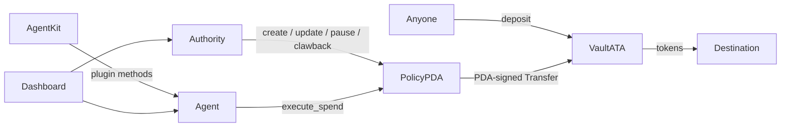

# PolicyKit Architecture

Open Solana-native on-chain policy engine for AI agents. Humans fund a vault; agents spend only under rules enforced by the program.

## System context



| Component | Role |
|-----------|------|
| **Authority** | Human or protocol wallet; ultimate control |
| **Agent** | Hot key allowed to call `execute_spend` |
| **Policy PDA** | Rules + counters; vault authority |
| **Vault ATA** | Holds `spend_mint` (and any mistaken deposits) |
| **Agent Kit plugin** | Forces vault spends through PolicyKit |
| **Dashboard** | Demo control room (localnet/devnet) |
| **SDK** | Typed client, templates, error mapping |

## Package map

```
programs/policykit/          # Anchor on-chain program
packages/sdk/                # @policykit/sdk
packages/agent-kit-plugin/   # @policykit/agent-kit-plugin
apps/dashboard/              # Next.js demo UI
tests/                       # Integration tests (anchor test)
docs/                        # Design, security, threat model
```

## `execute_spend` flow (on-chain)

1. Signer is `policy.agent` (`has_one`)  
2. Load vault (mint + authority = policy PDA)  
3. Load destination (same mint; owner ≠ policy PDA)  
4. `check_and_record_spend`: amount > 0 → active → refresh windows → spend_mint → program lists → mint list → rate → per-tx/daily + record  
5. Vault balance ≥ amount  
6. PDA-signed classic SPL `Transfer`  
7. Emit `SpendExecuted`  

Failed checks abort the transaction; counters are not committed.

## Data ownership

| Data | Where | Notes |
|------|-------|-------|
| Policy rules / counters | On-chain Policy PDA | Source of truth |
| Vault balances | On-chain token accounts | PDA authority |
| Activity feed (dashboard) | Browser session / localStorage | Demo only |
| Demo agent secret | localStorage | **Not** production |

## PDA seeds

```
Policy = PDA(["policy", authority, policy_id_le_bytes], program_id)
Vault  = ATA(Policy, mint)   // created client-side
```

Program ID (local/devnet deploy keypair): see `Anchor.toml` / `POLICYKIT_PROGRAM_ID` in the SDK.

## Non-goals (MVP)

Documented in [PROGRAM_DESIGN.md](./PROGRAM_DESIGN.md): hierarchical policies, Token-2022 hooks, full CPI proxy into Jupiter/DeFi, multi-asset agent spends, multi-sig authority.

## Related docs

- [PROGRAM_DESIGN.md](./PROGRAM_DESIGN.md) — account fields and instructions  
- [SECURITY.md](./SECURITY.md) — invariants  
- [THREAT_MODEL.md](./THREAT_MODEL.md) — threats and residuals  
- [ERROR_CATALOG.md](./ERROR_CATALOG.md) — error codes  
- [DEVNET.md](./DEVNET.md) — Phase C deploy + live proof 
