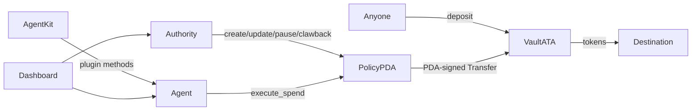

# Phase A — Quality Foundation Implementation Plan

> **For agentic workers:** REQUIRED SUB-SKILL: Use superpowers:subagent-driven-development (recommended) or superpowers:executing-plans to implement this plan task-by-task. Steps use checkbox (`- [ ]`) syntax for tracking.

**Goal:** Make PolicyKit feel like professional open-source infrastructure: deterministic CI, denser tests (including pure unit tests for enforcement math), a written threat model, and docs that match the code — without adding product features.

**Architecture:** Keep the existing Anchor 0.32 + classic SPL + yarn monorepo. Phase A only adds quality surfaces: GitHub Actions, expanded integration tests, a small Node unit-test suite for SDK pure functions, threat-model / error-catalog / contributing docs, and hygiene (LICENSE, CHANGELOG, architecture diagram). No new instructions, no Token-2022, no dashboard features.

**Tech Stack:** Anchor `0.32.1`, Solana CLI (Agave), classic SPL Token, TypeScript, yarn workspaces, mocha/chai (`anchor test` + optional mocha for unit tests), GitHub Actions `ubuntu-latest`.

**Estimated effort:** ~1.5–2.5 focused engineering weeks (can parallelize Tasks 2–4 after Task 1 scaffold).

**Out of scope (Phase B+):** Destination allowlist, Helius webhooks, dashboard completeness (`set_agent` UI), multi-mint agent spends, CPI mediation, Token-2022, mainnet launch campaign.

## Global Constraints

- Do **not** change money-path semantics unless a real bug is found during the security pass; if a bug is found, fix it with a regression test and document it in CHANGELOG.
- Stack pins: Anchor **0.32.x**, classic **SPL Token only**, `@solana/web3.js` **v1**, **yarn** workspaces (see `AGENTS.md`).
- Never commit keypairs (`**/id.json`, `**/*-keypair.json`, `target/deploy/*.json` secrets).
- CI must use **Anchor 0.32.x** matching `Cargo.toml` / `package.json` — **not** whatever Anchor CLI is installed locally (local env may be `anchor-cli 1.0.x` while the program is 0.32.1).
- Prefer extending `tests/policykit.ts` and `tests/sdk_and_plugin.ts` over new heavy frameworks for on-chain cases.
- Pure logic unit tests live in `packages/sdk` (no validator required).
- All new docs go under `docs/` unless they are root-facing (`README.md`, `LICENSE`, `CHANGELOG.md`, `CONTRIBUTING.md`).
- Definition of done for Phase A is the checklist at the end of this document — green CI + docs reviewed.

---

## Current baseline (as of 2026-07-31)

| Area | Status |
|------|--------|
| On-chain program | Complete MVP (8 instructions) |
| Integration tests | `tests/policykit.ts` (~24 its), `tests/sdk_and_plugin.ts` (~17 its) — strong pitch coverage |
| Unit tests | **None** for SDK helpers / window math |
| CI | **No** `.github/workflows` |
| SECURITY / PROGRAM_DESIGN | Present, solid; no dedicated threat-model table of trust assumptions |
| Error catalog | In `error.rs` + SDK `errors.ts`; not mirrored as a single docs table |
| LICENSE file | **Missing** (README claims MIT) |
| CHANGELOG / CONTRIBUTING | **Missing** |
| Architecture diagram | Described in README as ASCII only |

### Known untested / lightly tested rejection paths

| Error / behavior | Integration coverage today |
|------------------|----------------------------|
| `InsufficientVaultBalance` | Missing explicit case |
| `ProgramListTooLong` / `MintListTooLong` | Missing |
| `InvalidRateWindow` | Missing |
| `EmptyMintAllowlist` | Missing (empty **program** allowlist is covered) |
| `MintMismatch` | Missing explicit case |
| `InvalidVaultAuthority` | Missing explicit case |
| Unauthorized authority on `update` / `clawback` / `set_agent` | Missing explicit outsider-as-authority cases |
| Day-window reset after 86400s | Not covered (Clock warp hard under default validator) |
| SDK `refreshPolicyWindows` day/rate math | No pure unit tests |
| SDK error mapping for all codes 6000–6023 | Partial via integration only |
| `yarn build:dashboard` | Not in CI |

---

## File map (create / modify)

| Path | Role |
|------|------|
| `.github/workflows/ci.yml` | **Create** — build, test, lint, dashboard typecheck/build |
| `LICENSE` | **Create** — MIT |
| `CHANGELOG.md` | **Create** — Keep a Changelog style |
| `CONTRIBUTING.md` | **Create** — build/test/PR rules |
| `docs/THREAT_MODEL.md` | **Create** — actors, assets, trust boundaries, residual risks |
| `docs/ERROR_CATALOG.md` | **Create** — code → name → when → client title |
| `docs/ARCHITECTURE.md` | **Create** — diagram + component map |
| `docs/SECURITY.md` | **Modify** — link threat model; fix any drift found |
| `docs/PROGRAM_DESIGN.md` | **Modify** — only if security pass finds doc drift |
| `README.md` | **Modify** — badges, doc index, one-command verify, architecture link |
| `AGENTS.md` | **Modify** — Phase A verify commands |
| `package.json` | **Modify** — scripts: `test:unit`, `ci`, `typecheck` |
| `packages/sdk/package.json` | **Modify** — unit test script + mocha devDep if needed |
| `packages/sdk/src/helpers.ts` | **Modify** only if unit tests expose pure-function bugs |
| `packages/sdk/src/errors.ts` | **Modify** only if catalog mismatches |
| `packages/sdk/test/helpers.test.ts` | **Create** — pure unit tests |
| `packages/sdk/test/errors.test.ts` | **Create** — error map completeness |
| `packages/sdk/test/pda.test.ts` | **Create** — PDA seed determinism |
| `tests/policykit.ts` | **Modify** — new rejection / edge cases |
| `tests/sdk_and_plugin.ts` | **Modify** — only if needed for error mapping parity |
| `programs/policykit/**` | **Modify** only if security review finds a real bug |

---

### Task 1: Repo hygiene scaffold (LICENSE, CHANGELOG, CONTRIBUTING, scripts)

**Files:**
- Create: `LICENSE`, `CHANGELOG.md`, `CONTRIBUTING.md`
- Modify: `package.json`, `README.md` (doc index only in this task if preferred; full README polish in Task 6)

**Why first:** Establishes legal + process baseline every later PR references.

- [ ] **Step 1: Add MIT LICENSE**

Use standard MIT text. Copyright holder: use the GitHub owner / project name already on the remote (`criptocbas` / PolicyKit) unless the user specifies otherwise before execution.

```text
MIT License

Copyright (c) 2026 PolicyKit contributors

Permission is hereby granted, free of charge, to any person obtaining a copy...
```

- [ ] **Step 2: Add CHANGELOG.md**

```markdown
# Changelog

All notable changes to this project will be documented in this file.

The format is based on [Keep a Changelog](https://keepachangelog.com/en/1.1.0/),
and this project adheres to [Semantic Versioning](https://semver.org/spec/v2.0.0.html).

## [Unreleased]

### Added
- Phase A quality foundation (CI, unit tests, threat model, docs).

## [0.1.0] - 2026-07-30

### Added
- Anchor program: create/update/pause/set_agent/deposit/clawback/execute_spend.
- `@policykit/sdk` and `@policykit/agent-kit-plugin`.
- Next.js demo dashboard.
- Integration tests for pitch success/failure paths.
```

- [ ] **Step 3: Add CONTRIBUTING.md**

Must include:

1. Prerequisites: Solana CLI, Anchor **0.32.x**, Node 20+, yarn  
2. `yarn install` → `anchor build` → `anchor test`  
3. Stack pins pointer to `AGENTS.md`  
4. PR requirements: tests for money-path changes; update `docs/SECURITY.md` if invariants change; never commit keypairs  
5. How to run unit tests vs integration tests  

- [ ] **Step 4: Add root scripts**

In `package.json` scripts (names exact):

```json
{
  "test:unit": "yarn workspace @policykit/sdk test",
  "test:integration": "yarn build:packages && anchor test",
  "typecheck:packages": "yarn workspace @policykit/sdk build && yarn workspace @policykit/agent-kit-plugin build",
  "typecheck:dashboard": "yarn workspace @policykit/dashboard exec tsc --noEmit",
  "ci:local": "yarn typecheck:packages && yarn test:unit && yarn test:integration"
}
```

Wire `@policykit/sdk` `"test"` script in Task 3 when unit tests exist; for this task, stub:

```json
"test": "mocha --require ts-node/register 'test/**/*.test.ts' --timeout 10000"
```

(or `ts-mocha` consistent with root) and add necessary devDependencies in Task 3.

- [ ] **Step 5: Commit**

```bash
git add LICENSE CHANGELOG.md CONTRIBUTING.md package.json
git commit -m "docs: add LICENSE, CHANGELOG, CONTRIBUTING and ci script stubs"
```

---

### Task 2: CI pipeline (GitHub Actions)

**Files:**
- Create: `.github/workflows/ci.yml`
- Modify: `README.md` (CI badge — can wait for Task 6)

**Interfaces:**
- Produces: green checks on `push` / `pull_request` to `main` (and `master` if used)
- Consumes: `yarn.lock`, `Cargo.lock`, `Anchor.toml`, workspace packages

- [ ] **Step 1: Write workflow that pins toolchains**

Requirements for `ci.yml`:

| Job | What it does |
|-----|----------------|
| `sdk-unit` | `yarn install --frozen-lockfile`, build packages, run unit tests (no validator) |
| `program-test` | Install Solana + Anchor **0.32.1**, `yarn install`, `anchor build`, `anchor test` |
| `dashboard` | `yarn install`, `yarn build:packages`, `yarn build:dashboard` (or `tsc --noEmit` if full Next build is too heavy — prefer full `build:dashboard` if CI time &lt; 15m) |
| `fmt-clippy` (optional but recommended) | `cargo fmt --check` in `programs/policykit`, `cargo clippy -p policykit -- -D warnings` if clean; if clippy is noisy on first run, start with `fmt` only and fix clippy in a follow-up commit |

**Critical pin:** Install Anchor CLI **0.32.1** (avm), not latest 1.x.

Suggested structure (implementer may adjust action versions to current stable):

```yaml
name: CI

on:
  push:
    branches: [main, master]
  pull_request:

concurrency:
  group: ci-${{ github.ref }}
  cancel-in-progress: true

jobs:
  sdk-unit:
    runs-on: ubuntu-latest
    steps:
      - uses: actions/checkout@v4
      - uses: actions/setup-node@v4
        with:
          node-version: "20"
          cache: yarn
      - run: yarn install --frozen-lockfile
      - run: yarn typecheck:packages
      - run: yarn test:unit

  program-test:
    runs-on: ubuntu-latest
    steps:
      - uses: actions/checkout@v4
      - uses: actions/setup-node@v4
        with:
          node-version: "20"
          cache: yarn
      - name: Install Solana
        # pin a known Agave/solana release compatible with Anchor 0.32
        run: |
          sh -c "$(curl -sSfL https://release.anza.xyz/v2.1.0/install)"
          echo "$HOME/.local/share/solana/install/active_release/bin" >> $GITHUB_PATH
      - name: Install Anchor 0.32.1
        run: |
          cargo install --git https://github.com/coral-xyz/anchor avm --locked --force
          avm install 0.32.1
          avm use 0.32.1
          anchor --version
      - run: yarn install --frozen-lockfile
      - run: anchor build
      - run: yarn build:packages
      - run: anchor test

  dashboard:
    runs-on: ubuntu-latest
    steps:
      - uses: actions/checkout@v4
      - uses: actions/setup-node@v4
        with:
          node-version: "20"
          cache: yarn
      - run: yarn install --frozen-lockfile
      - run: yarn build:dashboard
```

**Note for implementer:** Solana install URL / version may need one iteration to match what `anchor 0.32.1` expects on CI. Document the final pins in `CONTRIBUTING.md`.

- [ ] **Step 2: Run workflow logic locally as far as possible**

```bash
yarn ci:local
# If Solana validator/tests too heavy locally, at least:
yarn typecheck:packages && yarn test:unit && yarn build:dashboard
```

- [ ] **Step 3: Push branch and confirm Actions green (or fix until green)**

- [ ] **Step 4: Commit**

```bash
git add .github/workflows/ci.yml CONTRIBUTING.md
git commit -m "ci: add GitHub Actions for unit, anchor test, and dashboard build"
```

---

### Task 3: SDK pure unit tests (no validator)

**Files:**
- Create: `packages/sdk/test/helpers.test.ts`
- Create: `packages/sdk/test/errors.test.ts`
- Create: `packages/sdk/test/pda.test.ts`
- Modify: `packages/sdk/package.json` (test script + devDeps: mocha, chai, ts-node or ts-mocha, @types/*)
- Modify: root `package.json` if needed for shared test runner

**Interfaces:**
- Consumes: `refreshPolicyWindows`, `remainingDaily`, `remainingActions`, `isActive`, `isExpired`, `previewSpend`, `mapPolicyKitError` / error code table, `findPolicyPda`, `policyIdToSeed`
- Produces: `yarn workspace @policykit/sdk test` exit 0

- [ ] **Step 1: Add test runner to `@policykit/sdk`**

Prefer **ts-mocha** (already used at monorepo root) to avoid new patterns:

```json
"scripts": {
  "build": "tsc -p tsconfig.json",
  "clean": "rm -rf dist",
  "test": "ts-mocha -p tsconfig.json -t 10000 'test/**/*.test.ts'"
}
```

Add devDependencies as needed: `ts-mocha`, `mocha`, `chai`, `@types/mocha`, `@types/chai`, `typescript` (already present).

Ensure `tsconfig` includes `test/` or use ts-mocha `-p` with allowJs as needed. Do **not** emit test files into `dist/`.

- [ ] **Step 2: Write `helpers.test.ts` — window math mirrors on-chain**

Cover at least:

1. **Day window not elapsed** → `spentToday` unchanged; `remainingDaily` = max - spent  
2. **Day window elapsed by exactly 86400** → `spentToday` resets to 0; `dayStartTs` advances by whole periods  
3. **Day window elapsed by multiple days** → periods = floor(elapsed/86400)  
4. **Rate window not elapsed** → `actionsInWindow` unchanged  
5. **Rate window elapsed** → `actionsInWindow = 0`, `windowStartTs = now`  
6. **`maxPerDay = 0`** → `remainingDaily` is `null` (unlimited)  
7. **`maxActionsPerWindow = 0`** → `remainingActions` is `null`  
8. **`isExpired`**: `expiresAt = 0` never; `now >= expiresAt` true  
9. **`isActive`**: paused or expired → false  
10. **`previewSpend`**: over per-tx, over daily, paused, expired, wrong mint → expected error names  

Use a minimal fake `PolicyAccount` factory in the test file (construct BN fields explicitly). Mirror field names from `packages/sdk/src/types.ts`.

Example shape (adapt to actual type fields):

```ts
import { expect } from "chai";
import BN from "bn.js";
import { PublicKey } from "@solana/web3.js";
import {
  refreshPolicyWindows,
  remainingDaily,
  remainingActions,
  isActive,
  isExpired,
  previewSpend,
} from "../src/helpers";
// + types

const SECONDS_PER_DAY = 86_400;

function makePolicy(overrides: Partial<...> = {}): PolicyAccount {
  // fill required fields with sensible defaults
}
```

- [ ] **Step 3: Write `errors.test.ts` — catalog completeness**

Assert:

- Every code from **6000 through 6023** has a mapping entry  
- Known pitch titles exist: `"Over daily budget"`, `"Program not allowed"`, `"Rate limited"`, `"Policy paused"`, `"Policy expired"`, `"Not agent"`, `"Over per-tx limit"`  
- `mapPolicyKitError` / equivalent returns stable `errorName` for a synthetic Anchor-like error object if the SDK supports it  

- [ ] **Step 4: Write `pda.test.ts`**

```ts
// findPolicyPda(authority, id, programId) is deterministic
// different policy_id → different PDA
// policyIdToSeed little-endian matches on-chain expectation (document with a fixed vector)
```

Fixed vector approach: hardcode authority pubkey + policy_id + program id → expected PDA string from a one-time local computation committed as fixture.

- [ ] **Step 5: Run unit tests**

```bash
yarn workspace @policykit/sdk test
```

Expected: all pass.

- [ ] **Step 6: Commit**

```bash
git add packages/sdk/test packages/sdk/package.json yarn.lock package.json
git commit -m "test(sdk): add pure unit tests for helpers, errors, and PDAs"
```

---

### Task 4: Expand on-chain integration tests (rejection matrix)

**Files:**
- Modify: `tests/policykit.ts`
- Optionally modify: `tests/sdk_and_plugin.ts` for any client-visible gap

**Interfaces:**
- Consumes: existing helpers in `tests/policykit.ts` (`createMint`, `createAta`, `deposit`, `policyId`, etc.)
- Produces: new `it(...)` cases; full `anchor test` green

- [ ] **Step 1: Add cases for list/window validation on create/update**

| Case | Expected error |
|------|----------------|
| create with `program_allowlist_enabled` and 11 pubkeys | `ProgramListTooLong` |
| create with `mint_allowlist_enabled` and 11 pubkeys | `MintListTooLong` |
| create with `mint_allowlist_enabled` and empty vec | `EmptyMintAllowlist` |
| create with `max_actions_per_window > 0` and `window_seconds = 0` | `InvalidRateWindow` |
| update_policy enabling empty program allowlist | `EmptyProgramAllowlist` |

- [ ] **Step 2: Add money-path edge cases**

| Case | Expected error / behavior |
|------|---------------------------|
| `execute_spend` amount &gt; vault balance (limits would pass) | `InsufficientVaultBalance` |
| vault token account with wrong owner (not policy PDA) | `InvalidVaultAuthority` (or account constraint fail — assert stable client-facing failure) |
| destination ATA mint ≠ vault mint | `MintMismatch` |
| outsider signs `update_policy` | authority check fail (`UnauthorizedAuthority` or Anchor `ConstraintHasOne`) |
| outsider signs `clawback` | same |
| outsider signs `set_agent` | same |
| anyone (outsider) can `deposit` | **success** (documents open deposit model) |
| second policy with `policy_id = 2` same authority | independent PDA + independent vault |

- [ ] **Step 3: Keep tests readable**

- Reuse existing mint/ATA helpers  
- Prefer small dedicated policies per negative case (as existing tests already do)  
- Assert with `AnchorError` error code / name consistently with existing style in the file  

- [ ] **Step 4: Run integration tests**

```bash
yarn build:packages
anchor build
anchor test
```

Expected: all previous + new cases pass.

- [ ] **Step 5: Commit**

```bash
git add tests/policykit.ts tests/sdk_and_plugin.ts
git commit -m "test: expand on-chain rejection and authority edge coverage"
```

---

### Task 5: Security pass + threat model (docs first, code only if bugs)

**Files:**
- Create: `docs/THREAT_MODEL.md`
- Create: `docs/ERROR_CATALOG.md`
- Modify: `docs/SECURITY.md` (cross-links + any corrections)
- Modify: `programs/policykit/**` **only if** a real bug is found
- Modify: `CHANGELOG.md` if code fixes land

**Process (mandatory order):**

1. Read every money-path instruction end-to-end  
2. Write threat model from evidence (not marketing)  
3. If bug found → regression test (Task 4 style) → minimal fix → CHANGELOG  

- [ ] **Step 1: Manual review checklist (tick in PR description)**

Review these files line-by-line:

- `programs/policykit/src/state/policy.rs` — `check_and_record_spend`, `refresh_windows`  
- `programs/policykit/src/instructions/execute_spend.rs`  
- `programs/policykit/src/instructions/deposit.rs`  
- `programs/policykit/src/instructions/clawback.rs`  
- `programs/policykit/src/instructions/create_policy.rs`  
- `programs/policykit/src/instructions/update_policy.rs`  
- `programs/policykit/src/instructions/set_agent.rs`  
- `programs/policykit/src/instructions/pause.rs`  
- `programs/policykit/src/token_utils.rs`  
- `packages/agent-kit-plugin/src/methods.ts` — preflight + agent wallet check  

Checklist items:

- [ ] Counters never commit if transfer fails (ordering)  
- [ ] Agent cannot clawback / pause / update  
- [ ] Authority cannot be stolen via reinit  
- [ ] Default pubkey rejected as agent  
- [ ] Destination cannot be policy-owned ATA  
- [ ] Non-`spend_mint` cannot exit via `execute_spend`  
- [ ] Token program pinned to classic SPL  
- [ ] PDA seeds bind authority + policy_id  
- [ ] Plugin cannot spend if wallet ≠ policy.agent  
- [ ] Document residual: intent spoof, co-loaded Agent Kit plugins, open deposit  

- [ ] **Step 2: Write `docs/THREAT_MODEL.md`**

Required sections:

1. **Assets** — vault balances, policy config, agent key, authority key  
2. **Actors** — authority, agent, depositor (anyone), malicious program, compromised agent host  
3. **Trust boundaries** — on-chain program vs Agent Kit host vs wallet infra  
4. **In-scope threats** — table: threat → mitigation → residual  
5. **Out-of-scope** — full agent sandbox, TEE, KYC, price oracle integrity  
6. **Intent program limitation** — explicit worked example of spoofed intent under caps  
7. **Operational recommendations** — pointer to SECURITY.md  

Example threat row format:

| ID | Threat | Impact | Mitigation | Residual |
|----|--------|--------|------------|----------|
| T1 | Compromised agent key | Drain up to remaining daily/per-tx | Caps, rate limit, pause, clawback, allowlists | Until paused, agent can spend within caps |
| T2 | Spoofed `intent_program` | Funds sent to unintended dest | Caps + mint allowlist; monitoring | Not full CPI mediation |
| T3 | Malicious depositor | Dust / wrong mint in vault | Clawback; spend_mint-only agent path | Wrong mints sit until clawback |

- [ ] **Step 3: Write `docs/ERROR_CATALOG.md`**

Table generated from `error.rs` + SDK titles:

| Code | Name | When it fires | SDK title (if any) |
|------|------|---------------|--------------------|
| 6000 | PolicyPaused | … | Policy paused |
| … | … | … | … |
| 6023 | InvalidDestination | … | … |

Must stay in sync with `error.rs` — CONTRIBUTING says: new error ⇒ update this doc + SDK map + test.

- [ ] **Step 4: Cross-link SECURITY.md**

Add at top:

```markdown
> Full adversarial model: [THREAT_MODEL.md](./THREAT_MODEL.md). Error reference: [ERROR_CATALOG.md](./ERROR_CATALOG.md).
```

Fix any factual drift found during review (e.g. check order, token program notes).

- [ ] **Step 5: If bug found**

1. Add failing test first  
2. Minimal fix  
3. CHANGELOG under `### Fixed`  
4. Note residual risk if partial  

- [ ] **Step 6: Commit**

```bash
git add docs/THREAT_MODEL.md docs/ERROR_CATALOG.md docs/SECURITY.md
# + any program fixes + tests + CHANGELOG
git commit -m "docs(security): add threat model and error catalog"
```

---

### Task 6: Architecture docs + README professional polish

**Files:**
- Create: `docs/ARCHITECTURE.md`
- Modify: `README.md`, `AGENTS.md`, `packages/sdk/README.md`, `packages/agent-kit-plugin/README.md` (brief cross-links)

- [ ] **Step 1: Write `docs/ARCHITECTURE.md`**

Contents:

1. System context diagram (ASCII or mermaid): Authority, Agent, Policy PDA, Vault ATA, Agent Kit, Dashboard  
2. Instruction flow for `execute_spend` (numbered check list matching code)  
3. Package map: `programs/`, `packages/sdk`, `packages/agent-kit-plugin`, `apps/dashboard`, `tests/`  
4. Data ownership: what is on-chain vs localStorage (dashboard demo)  
5. Non-goals of MVP (link PROGRAM_DESIGN)  

Mermaid example:



- [ ] **Step 2: Upgrade root README**

Add:

- CI badge (once workflow exists)  
- **Docs index** table linking DESIGN, SECURITY, THREAT_MODEL, ERROR_CATALOG, ARCHITECTURE, CONTRIBUTING, CHANGELOG  
- **Verify** section:

```bash
yarn install
yarn ci:local   # or document CI-equivalent commands
```

- Keep existing quickstart and agent kit sections  
- Explicit **Status: Phase A quality** / MVP feature-complete note  
- License line matches `LICENSE`  

- [ ] **Step 3: AGENTS.md verify block**

Update definition of done to include:

```bash
yarn test:unit
anchor build && anchor test
yarn build:dashboard   # if UI touched
```

- [ ] **Step 4: Package README one-liners**

SDK and plugin READMEs: link to root docs + error catalog; state peer dependency versions.

- [ ] **Step 5: Final local verification**

```bash
yarn install --frozen-lockfile
yarn typecheck:packages
yarn test:unit
anchor build && anchor test
yarn build:dashboard
```

All must pass before Phase A is closed.

- [ ] **Step 6: Commit**

```bash
git add docs/ARCHITECTURE.md README.md AGENTS.md packages/sdk/README.md packages/agent-kit-plugin/README.md
git commit -m "docs: architecture guide and professional README polish"
```

---

### Task 7: Phase A gate (review + freeze)

**Files:** none required (PR + checklist)

- [ ] **Step 1: Open PR (or review commit stack) titled `Phase A: quality foundation`**

PR body must include:

- Link to this plan  
- Security review checklist (Task 5) filled  
- Notes on any bugs fixed  
- CI link green  

- [ ] **Step 2: Phase A acceptance checklist**

| Criterion | Met? |
|-----------|------|
| `LICENSE` present (MIT) | |
| `CHANGELOG.md` + `CONTRIBUTING.md` present | |
| CI runs unit + anchor test + dashboard build | |
| SDK unit tests for window math + error codes + PDA | |
| Integration tests cover InsufficientVaultBalance + list limits + InvalidRateWindow + unauthorized authority paths | |
| `docs/THREAT_MODEL.md` + `docs/ERROR_CATALOG.md` + `docs/ARCHITECTURE.md` | |
| `docs/SECURITY.md` cross-linked and accurate | |
| No known failing tests on main | |
| No secrets / keypairs in tree | |
| Stack pins unchanged unless justified | |

- [ ] **Step 3: Tag mental milestone**

Not necessarily a git tag, but CHANGELOG: move Unreleased Phase A notes into a dated section if releasing `0.1.1` quality cut:

```markdown
## [0.1.1] - YYYY-MM-DD
### Added
- CI, unit tests, threat model, error catalog, architecture docs
```

- [ ] **Step 4: Stop — do not start Phase B features in the same PR**

---

## Risk register (Phase A)

| Risk | Mitigation |
|------|------------|
| CI Anchor/Solana install flaky | Pin versions; document; iterate once on a branch |
| `anchor test` too slow for every push | Keep single workflow; optional `paths` filters later |
| Clippy too noisy | fmt-only first; clippy as follow-up |
| Security review finds deep design issue (intent) | Document as residual risk — do **not** attempt full CPI mediation in Phase A |
| Local Anchor CLI 1.x vs project 0.32 | CI and CONTRIBUTING pin 0.32.1; AGENTS.md already warns |

---

## Suggested commit sequence

1. `docs: LICENSE, CHANGELOG, CONTRIBUTING, scripts`  
2. `ci: GitHub Actions`  
3. `test(sdk): unit tests`  
4. `test: integration rejection matrix`  
5. `docs(security): threat model + error catalog` (+ any fixes)  
6. `docs: architecture + README polish`  

---

## After Phase A (preview only — not this plan)

- **Phase B:** dashboard completeness, chain activity feed, destination allowlist / tighter spend bounds  
- **Phase C:** public devnet deploy + live demo agent  
- **Phase D:** distribution (Agent Kit, x402 template)

---

## Self-review (plan vs Phase A intent)

| Phase A intent | Covered by |
|----------------|------------|
| Tests culture | Tasks 3–4, CI Task 2 |
| CI | Task 2 |
| Security pass | Task 5 |
| Professional docs | Tasks 1, 5, 6 |
| No product feature creep | Global constraints + Task 7 freeze |

No placeholder tasks remain; tool pins may need one empirical CI tweak (called out explicitly).
